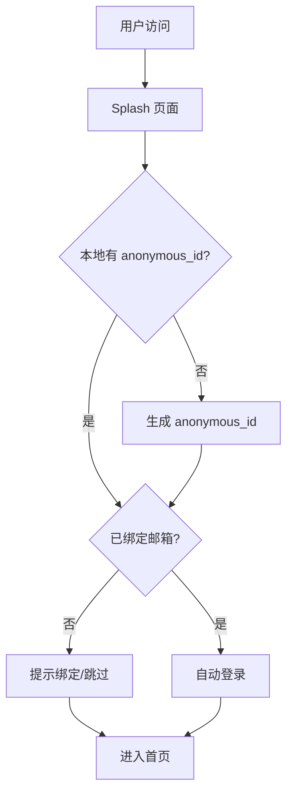
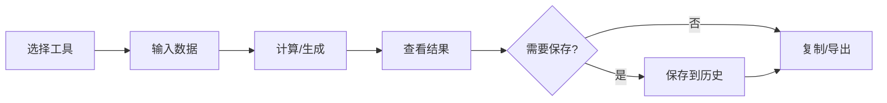
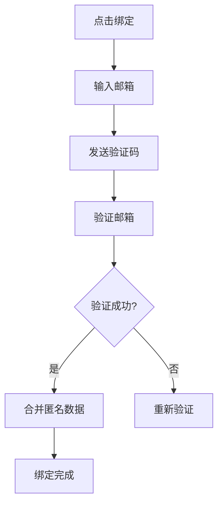

# 产品需求文档（PRD）

> Daniel Mall - 客服工具订阅平台

---

## 一、产品定位

### 1.1 产品愿景

> **打造客服每天都会打开的工具箱**

### 1.2 价值主张

| 维度         | 说明                               |
| ------------ | ---------------------------------- |
| **核心价值** | 工具优先，直接解决客服真实工作问题 |
| **差异化**   | 打开即用、按需使用、用完即走       |
| **商业模式** | 当前免费 → 未来订阅制              |

### 1.3 产品形态

- **Web 应用**（首要）
- 未来可扩展至小程序、App

---

## 二、用户画像

### 2.1 一线客服（Primary User）

```
角色：电商售前/售后客服
年龄：20-35岁
工作特点：
  - 日均处理 100+ 咨询
  - 高重复性工作
  - 对效率工具敏感

核心需求：
  - 快速计算 KPI
  - 话术模板复制
  - 投诉处理参考

使用场景：
  - 工作间隙快速计算
  - 处理客诉时查找话术
  - 下班前统计当日数据
```

### 2.2 客服组长（Team Leader）

```
角色：带 5-10 人小组
工作特点：
  - 既要做业务也要管理
  - 需要统计组内数据
  - 定期做组内培训

核心需求：
  - 团队数据汇总
  - 培训材料生成
  - SOP 文档管理

使用场景：
  - 周会前准备数据
  - 新人入职培训
  - 绩效统计
```

### 2.3 客服主管（Supervisor）

```
角色：管理 10-30 人团队
工作特点：
  - 关注整体指标
  - 需要向上汇报
  - 制定团队策略

核心需求：
  - 数据分析报表
  - 汇报材料生成
  - 流程优化工具

使用场景：
  - 月度复盘
  - 管理层汇报
  - 策略制定
```

### 2.4 客服经理（Manager）

```
角色：部门负责人
工作特点：
  - 战略层面决策
  - 跨部门协作
  - 预算与资源规划

核心需求：
  - 宏观数据分析
  - 决策支持工具
  - 行业趋势参考

使用场景：
  - 年度规划
  - 高管汇报
  - 战略复盘
```

---

## 三、使用流程

### 3.1 用户旅程

```
首次访问 → Splash → 匿名使用 → 发现价值 → 绑定邮箱 → 长期使用 → 付费升级
```

### 3.2 核心流程

#### 3.2.1 匿名访问流程



#### 3.2.2 工具使用流程



#### 3.2.3 邮箱绑定流程



---

## 四、工具分类与说明

### 4.1 工具分类体系

```
工具中心
├── 计算类工具
│   ├── KPI 计算器
│   ├── 人效计算器
│   ├── 转化率计算器
│   └── 客诉率统计
├── 模板类工具
│   ├── 话术模板生成器
│   ├── SOP 文档生成器
│   ├── 汇报模板
│   └── 培训文档模板
├── 分析类工具
│   ├── 数据趋势分析
│   ├── 客诉原因分析
│   └── 绩效对比分析
└── 职业成长
    ├── 技能评估
    ├── 成长路径
    └── 知识库
```

### 4.2 MVP 工具清单

| 优先级 | 工具名称   | 类型   | 说明                           |
| ------ | ---------- | ------ | ------------------------------ |
| P0     | KPI 计算器 | 计算类 | 核心工具，计算解决率、满意度等 |
| P0     | 话术模板   | 模板类 | 售前/售后/投诉话术             |
| P1     | 人效计算器 | 计算类 | 计算接待量、处理时长           |
| P1     | SOP 生成器 | 模板类 | 生成标准操作流程               |
| P2     | 汇报模板   | 模板类 | 日报/周报/月报模板             |
| P2     | 数据分析   | 分析类 | 简单趋势分析                   |

### 4.3 工具详细设计

#### KPI 计算器

**输入字段：**

- 总接待量
- 解决量
- 总处理时长（分钟）
- 满意评价数
- 总评价数

**输出指标：**

- 解决率 = 解决量 / 总接待量 × 100%
- 平均处理时长 = 总处理时长 / 解决量
- 满意度 = 满意评价数 / 总评价数 × 100%
- 每小时接待量 = 总接待量 / (总处理时长 / 60)

**功能：**

- 自动计算所有指标
- 一键复制结果
- 保存历史记录
- 导出为图片/Excel

---

## 五、MVP 范围与边界

### 5.1 MVP 包含

| 模块         | 功能点                       |
| ------------ | ---------------------------- |
| **用户系统** | 匿名访问、邮箱绑定、数据合并 |
| **工具中心** | 工具列表、工具详情、工具执行 |
| **历史记录** | 保存记录、查看历史、删除记录 |
| **收藏功能** | 添加收藏、取消收藏、收藏列表 |
| **主题系统** | 暗/亮/Hero 三主题切换        |

### 5.2 MVP 不包含

| 功能       | 原因           |
| ---------- | -------------- |
| 付费订阅   | 先验证产品价值 |
| 企业版     | 后续扩展       |
| 复杂权限   | MVP 阶段不需要 |
| 社交功能   | 非核心功能     |
| 移动端 App | Web 优先       |

### 5.3 成功标准

| 指标         | 目标              |
| ------------ | ----------------- |
| DAU          | 上线 1 月后 > 100 |
| 工具使用次数 | 单用户日均 > 3 次 |
| 邮箱绑定率   | > 20%             |
| 工具收藏率   | > 30%             |

---

## 六、非功能需求

### 6.1 性能要求

| 指标     | 要求    |
| -------- | ------- |
| 首屏加载 | < 2s    |
| 工具执行 | < 500ms |
| API 响应 | < 200ms |

### 6.2 兼容性要求

| 平台   | 要求                                       |
| ------ | ------------------------------------------ |
| 浏览器 | Chrome、Safari、Firefox、Edge 最新两个版本 |
| 移动端 | iOS Safari、Android Chrome                 |
| 分辨率 | 375px - 2560px                             |

### 6.3 安全要求

- 用户数据加密存储
- HTTPS 传输
- 敏感操作需要验证
