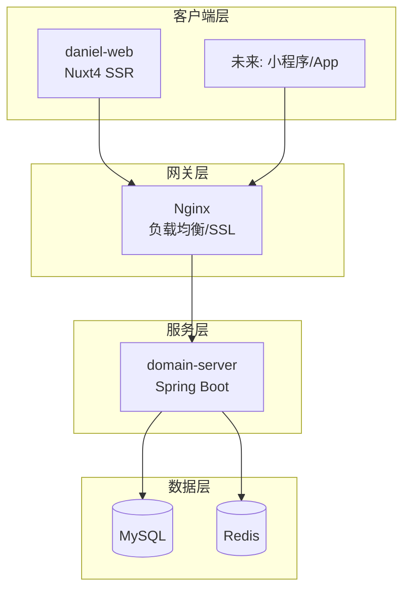
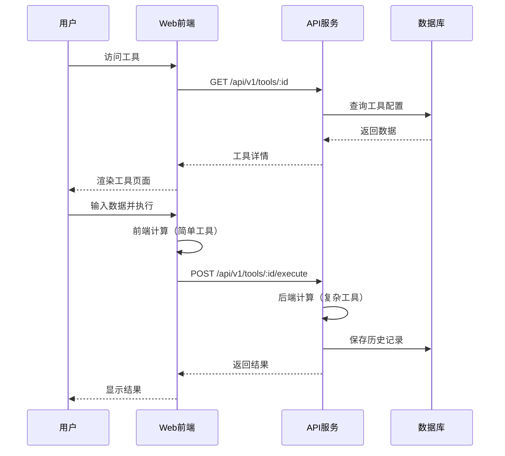
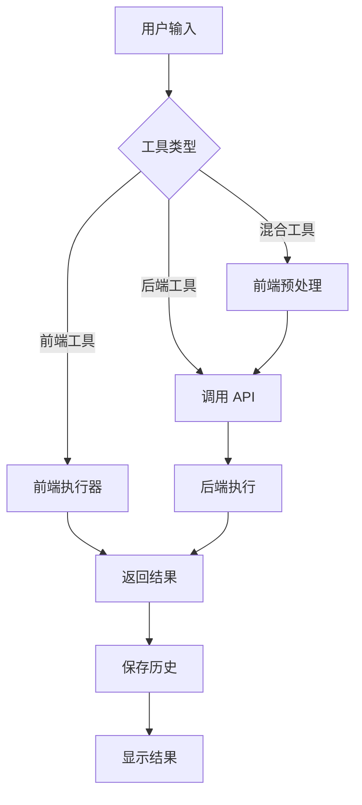
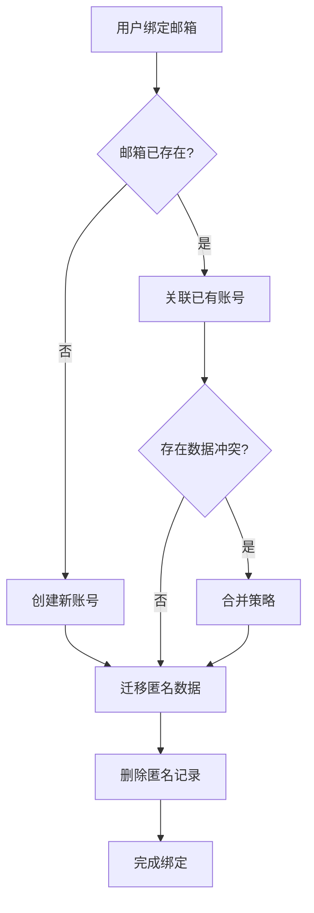

# 系统架构设计

> Daniel Mall - 技术架构文档

---

## 一、整体架构

### 1.1 架构概览



### 1.2 技术选型

| 层级       | 技术        | 版本 | 说明       |
| ---------- | ----------- | ---- | ---------- |
| **前端**   | Nuxt        | 4.x  | SSR 框架   |
| **前端**   | Vue         | 3.x  | 响应式框架 |
| **前端**   | TypeScript  | 5.x  | 类型安全   |
| **前端**   | TailwindCSS | 3.x  | 原子化 CSS |
| **后端**   | Spring Boot | 3.x  | 服务框架   |
| **后端**   | Java        | 21   | 运行时     |
| **数据库** | MySQL       | 8.x  | 主数据库   |
| **缓存**   | Redis       | 7.x  | 缓存/会话  |

---

## 二、前后端职责划分

### 2.1 前端职责

| 职责         | 说明                 |
| ------------ | -------------------- |
| **UI 渲染**  | 页面渲染、组件交互   |
| **状态管理** | 用户状态、工具状态   |
| **主题系统** | 三主题切换、CSS 变量 |
| **表单处理** | 输入验证、数据格式化 |
| **历史缓存** | 本地缓存、离线支持   |
| **响应式**   | PC/移动端适配        |

### 2.2 后端职责

| 职责           | 说明               |
| -------------- | ------------------ |
| **用户认证**   | 匿名用户、邮箱绑定 |
| **数据持久化** | 用户数据、历史记录 |
| **业务逻辑**   | 工具执行、数据处理 |
| **API 服务**   | RESTful API        |
| **权限控制**   | 访问控制（未来）   |

### 2.3 数据流



---

## 三、工具引擎设计

### 3.1 工具类型

| 类型           | 说明               | 执行位置  |
| -------------- | ------------------ | --------- |
| **纯前端工具** | 简单计算、格式转换 | 浏览器    |
| **混合工具**   | 需要后端数据支持   | 前端+后端 |
| **纯后端工具** | 复杂计算、数据分析 | 服务器    |

### 3.2 工具注册机制

```typescript
// 工具注册接口
interface ToolDefinition {
  id: string
  name: string
  category: string
  version: string

  // 工具配置
  config: {
    type: 'frontend' | 'backend' | 'hybrid'
    inputs: InputField[]
    outputs: OutputField[]
  }

  // 前端执行器（可选）
  execute?: (input: Record<string, unknown>) => Record<string, unknown>
}

// 工具注册表
const toolRegistry = new Map<string, ToolDefinition>()

// 注册工具
function registerTool(tool: ToolDefinition) {
  toolRegistry.set(tool.id, tool)
}
```

### 3.3 工具执行流程



---

## 四、匿名用户数据合并

### 4.1 合并策略



### 4.2 数据合并规则

| 数据类型 | 合并规则             |
| -------- | -------------------- |
| 历史记录 | 全部迁移，保留时间戳 |
| 收藏     | 合并去重             |
| 设置     | 以已有账号为准       |

### 4.3 实现代码

```java
@Service
public class UserMergeService {

    public void mergeAnonymousUser(String anonymousId, Long userId) {
        // 1. 迁移历史记录
        historyRepository.updateUserId(anonymousId, userId);

        // 2. 合并收藏（去重）
        List<Favorite> anonymousFavorites =
            favoriteRepository.findByAnonymousId(anonymousId);
        for (Favorite fav : anonymousFavorites) {
            if (!favoriteRepository.exists(userId, fav.getToolId())) {
                fav.setUserId(userId);
                favoriteRepository.save(fav);
            }
        }

        // 3. 删除匿名用户记录
        userRepository.deleteByAnonymousId(anonymousId);
    }
}
```

---

## 五、扩展点设计

### 5.1 工具扩展

```typescript
// 新增工具只需实现接口并注册
const newTool: ToolDefinition = {
  id: 'new-calculator',
  name: '新计算器',
  category: 'calculate',
  version: '1.0.0',
  config: {
    type: 'frontend',
    inputs: [...],
    outputs: [...]
  },
  execute: (input) => {
    // 计算逻辑
    return { result: ... }
  }
}

registerTool(newTool)
```

### 5.2 主题扩展

```scss
// 新增主题只需定义 CSS 变量
.theme-new {
  --dm-color-primary: #xxx;
  --dm-color-background: #xxx;
  // ...
}
```

### 5.3 API 扩展

```java
// 新增 API 遵循统一规范
@RestController
@RequestMapping("/api/v1/new-feature")
public class NewFeatureController {

    @GetMapping
    public Result<NewFeatureVO> get() {
        // ...
    }
}
```

---

## 六、部署架构

### 6.1 开发环境

```yaml
# docker-compose.dev.yml
services:
  web:
    build: ./daniel-web
    ports:
      - '3000:3000'
    volumes:
      - ./daniel-web:/app

  api:
    build: ./domain-server
    ports:
      - '8080:8080'
    depends_on:
      - mysql
      - redis

  mysql:
    image: mysql:8
    environment:
      MYSQL_ROOT_PASSWORD: root
      MYSQL_DATABASE: daniel_mall

  redis:
    image: redis:7
```

### 6.2 生产环境

```
                    ┌─────────────┐
                    │   CDN       │
                    └──────┬──────┘
                           │
                    ┌──────▼──────┐
                    │   Nginx     │
                    │ (SSL/LB)    │
                    └──────┬──────┘
           ┌───────────────┼───────────────┐
           │               │               │
    ┌──────▼──────┐ ┌──────▼──────┐ ┌──────▼──────┐
    │  Web Node 1 │ │  Web Node 2 │ │  API Node   │
    │  (Nuxt SSR) │ │  (Nuxt SSR) │ │ (Spring)    │
    └─────────────┘ └─────────────┘ └──────┬──────┘
                                           │
                           ┌───────────────┼───────────────┐
                           │               │               │
                    ┌──────▼──────┐ ┌──────▼──────┐
                    │   MySQL     │ │   Redis     │
                    │ (Primary)   │ │  (Cluster)  │
                    └─────────────┘ └─────────────┘
```
