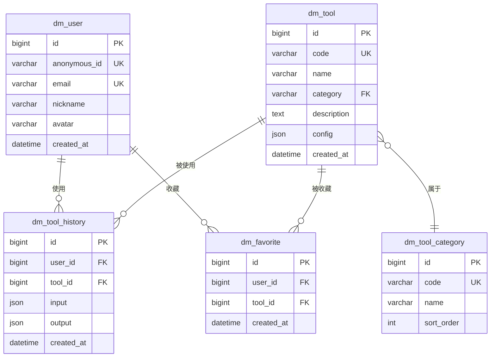

# 数据库设计

> Daniel Mall - MySQL 数据库设计文档

---

## 一、设计原则

### 1.1 命名规范

| 类型     | 规范                         | 示例          |
| -------- | ---------------------------- | ------------- |
| 表名     | `dm_` 前缀 + snake_case      | `dm_user`     |
| 字段名   | snake_case                   | `created_at`  |
| 主键     | `id` (BIGINT AUTO_INCREMENT) | `id`          |
| 外键字段 | `*_id`                       | `user_id`     |
| 时间字段 | `*_at`                       | `created_at`  |
| 布尔字段 | `is_*`                       | `is_active`   |
| 唯一索引 | `uk_*`                       | `uk_email`    |
| 普通索引 | `idx_*`                      | `idx_user_id` |

### 1.2 必备字段

每张表必须包含：

```sql
id BIGINT PRIMARY KEY AUTO_INCREMENT COMMENT '主键',
created_at DATETIME DEFAULT CURRENT_TIMESTAMP COMMENT '创建时间',
updated_at DATETIME DEFAULT CURRENT_TIMESTAMP ON UPDATE CURRENT_TIMESTAMP COMMENT '更新时间'
```

---

## 二、ER 图



---

## 三、表结构详细定义

### 3.1 dm_user 用户表

```sql
CREATE TABLE dm_user (
    id BIGINT PRIMARY KEY AUTO_INCREMENT COMMENT '主键',
    anonymous_id VARCHAR(64) NOT NULL COMMENT '匿名用户ID（UUID）',
    email VARCHAR(128) COMMENT '邮箱（可选）',
    nickname VARCHAR(64) COMMENT '昵称',
    avatar VARCHAR(512) COMMENT '头像URL',
    role VARCHAR(32) DEFAULT 'user' COMMENT '角色: user/admin',
    is_email_verified TINYINT(1) DEFAULT 0 COMMENT '邮箱是否已验证',
    last_login_at DATETIME COMMENT '最后登录时间',
    created_at DATETIME DEFAULT CURRENT_TIMESTAMP COMMENT '创建时间',
    updated_at DATETIME DEFAULT CURRENT_TIMESTAMP ON UPDATE CURRENT_TIMESTAMP COMMENT '更新时间',
    deleted_at DATETIME COMMENT '删除时间（软删除）',

    UNIQUE KEY uk_anonymous_id (anonymous_id),
    UNIQUE KEY uk_email (email),
    KEY idx_created_at (created_at),
    KEY idx_deleted_at (deleted_at)
) ENGINE=InnoDB DEFAULT CHARSET=utf8mb4 COLLATE=utf8mb4_unicode_ci COMMENT='用户表';
```

**字段说明：**

| 字段              | 类型         | 必填 | 说明              |
| ----------------- | ------------ | ---- | ----------------- |
| id                | BIGINT       | 是   | 主键              |
| anonymous_id      | VARCHAR(64)  | 是   | 匿名用户唯一标识  |
| email             | VARCHAR(128) | 否   | 绑定的邮箱        |
| nickname          | VARCHAR(64)  | 否   | 用户昵称          |
| avatar            | VARCHAR(512) | 否   | 头像 URL          |
| role              | VARCHAR(32)  | 是   | 角色（默认 user） |
| is_email_verified | TINYINT(1)   | 是   | 邮箱是否验证      |

### 3.2 dm_tool 工具表

```sql
CREATE TABLE dm_tool (
    id BIGINT PRIMARY KEY AUTO_INCREMENT COMMENT '主键',
    code VARCHAR(64) NOT NULL COMMENT '工具唯一代码',
    name VARCHAR(128) NOT NULL COMMENT '工具名称',
    description TEXT COMMENT '工具描述',
    category VARCHAR(64) NOT NULL COMMENT '分类代码',
    icon VARCHAR(512) COMMENT '图标URL',
    config JSON COMMENT '工具配置（输入输出定义）',
    sort_order INT DEFAULT 0 COMMENT '排序权重',
    is_active TINYINT(1) DEFAULT 1 COMMENT '是否启用',
    is_premium TINYINT(1) DEFAULT 0 COMMENT '是否付费工具',
    usage_count BIGINT DEFAULT 0 COMMENT '使用次数',
    created_at DATETIME DEFAULT CURRENT_TIMESTAMP COMMENT '创建时间',
    updated_at DATETIME DEFAULT CURRENT_TIMESTAMP ON UPDATE CURRENT_TIMESTAMP COMMENT '更新时间',

    UNIQUE KEY uk_code (code),
    KEY idx_category (category),
    KEY idx_sort_order (sort_order),
    KEY idx_is_active (is_active)
) ENGINE=InnoDB DEFAULT CHARSET=utf8mb4 COLLATE=utf8mb4_unicode_ci COMMENT='工具表';
```

**config 字段结构示例：**

```json
{
  "type": "frontend",
  "inputs": [
    {
      "key": "totalCalls",
      "label": "总接待量",
      "type": "number",
      "required": true
    },
    {
      "key": "resolvedCalls",
      "label": "解决量",
      "type": "number",
      "required": true
    }
  ],
  "outputs": [
    {
      "key": "resolutionRate",
      "label": "解决率",
      "type": "percent"
    }
  ]
}
```

### 3.3 dm_tool_category 工具分类表

```sql
CREATE TABLE dm_tool_category (
    id BIGINT PRIMARY KEY AUTO_INCREMENT COMMENT '主键',
    code VARCHAR(64) NOT NULL COMMENT '分类代码',
    name VARCHAR(64) NOT NULL COMMENT '分类名称',
    description VARCHAR(256) COMMENT '分类描述',
    icon VARCHAR(512) COMMENT '分类图标',
    sort_order INT DEFAULT 0 COMMENT '排序权重',
    is_active TINYINT(1) DEFAULT 1 COMMENT '是否启用',
    created_at DATETIME DEFAULT CURRENT_TIMESTAMP COMMENT '创建时间',
    updated_at DATETIME DEFAULT CURRENT_TIMESTAMP ON UPDATE CURRENT_TIMESTAMP COMMENT '更新时间',

    UNIQUE KEY uk_code (code),
    KEY idx_sort_order (sort_order)
) ENGINE=InnoDB DEFAULT CHARSET=utf8mb4 COLLATE=utf8mb4_unicode_ci COMMENT='工具分类表';
```

### 3.4 dm_tool_history 使用记录表

```sql
CREATE TABLE dm_tool_history (
    id BIGINT PRIMARY KEY AUTO_INCREMENT COMMENT '主键',
    user_id BIGINT NOT NULL COMMENT '用户ID',
    tool_id BIGINT NOT NULL COMMENT '工具ID',
    tool_code VARCHAR(64) NOT NULL COMMENT '工具代码（冗余）',
    input JSON NOT NULL COMMENT '输入参数',
    output JSON COMMENT '输出结果',
    execution_time INT COMMENT '执行耗时（毫秒）',
    created_at DATETIME DEFAULT CURRENT_TIMESTAMP COMMENT '创建时间',

    KEY idx_user_id (user_id),
    KEY idx_tool_id (tool_id),
    KEY idx_user_tool (user_id, tool_id),
    KEY idx_created_at (created_at)
) ENGINE=InnoDB DEFAULT CHARSET=utf8mb4 COLLATE=utf8mb4_unicode_ci COMMENT='工具使用记录表';
```

### 3.5 dm_favorite 收藏表

```sql
CREATE TABLE dm_favorite (
    id BIGINT PRIMARY KEY AUTO_INCREMENT COMMENT '主键',
    user_id BIGINT NOT NULL COMMENT '用户ID',
    tool_id BIGINT NOT NULL COMMENT '工具ID',
    created_at DATETIME DEFAULT CURRENT_TIMESTAMP COMMENT '创建时间',

    UNIQUE KEY uk_user_tool (user_id, tool_id),
    KEY idx_user_id (user_id),
    KEY idx_tool_id (tool_id)
) ENGINE=InnoDB DEFAULT CHARSET=utf8mb4 COLLATE=utf8mb4_unicode_ci COMMENT='收藏表';
```

---

## 四、索引策略

### 4.1 索引设计原则

1. **主键索引**：每张表必须有主键
2. **唯一索引**：业务唯一字段（如 email、code）
3. **外键索引**：所有 `*_id` 外键字段
4. **查询索引**：高频查询字段
5. **联合索引**：遵循最左前缀原则

### 4.2 索引清单

| 表名            | 索引名          | 字段             | 类型   |
| --------------- | --------------- | ---------------- | ------ |
| dm_user         | uk_anonymous_id | anonymous_id     | UNIQUE |
| dm_user         | uk_email        | email            | UNIQUE |
| dm_tool         | uk_code         | code             | UNIQUE |
| dm_tool         | idx_category    | category         | INDEX  |
| dm_tool_history | idx_user_tool   | user_id, tool_id | INDEX  |
| dm_favorite     | uk_user_tool    | user_id, tool_id | UNIQUE |

---

## 五、初始化数据

### 5.1 工具分类初始化

```sql
INSERT INTO dm_tool_category (code, name, icon, sort_order) VALUES
('calculate', '计算类工具', 'calculator', 1),
('template', '模板类工具', 'file-text', 2),
('analysis', '分析类工具', 'bar-chart', 3),
('growth', '职业成长', 'trending-up', 4);
```

### 5.2 工具初始化

```sql
INSERT INTO dm_tool (code, name, category, description, config, sort_order) VALUES
('kpi-calculator', 'KPI 计算器', 'calculate', '快速计算客服 KPI 指标', '{"type":"frontend","inputs":[...],"outputs":[...]}', 1),
('efficiency-calculator', '人效计算器', 'calculate', '计算客服人效指标', '{"type":"frontend","inputs":[...],"outputs":[...]}', 2),
('script-template', '话术模板', 'template', '售前/售后/投诉话术模板', '{"type":"frontend"}', 3);
```
